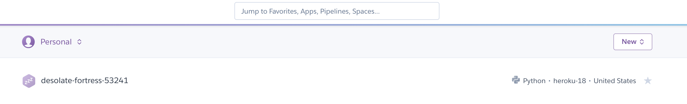
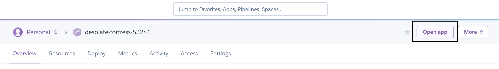

# Deploying a Wagtail Site on Heroku 

> We're using Wagtail 2.5.1, Django 2.2.1, and Python 3.6.8.

Demo site can be found at [https://desolate-fortress-53241.herokuapp.com/](https://desolate-fortress-53241.herokuapp.com/). It's the exact site I setup in the [YouTube tutorial video.](https://www.youtube.com/watch?v=RQ0eKv6HrpM)

### Stuff you need
Files you need are: 
* Procfile 
* runtime.txt 
* .env 
* requirements.txt

Services you'll need:
* A free heroku account [https://www.heroku.com/](https://www.heroku.com/)
* Heroku CLI [https://devcenter.heroku.com/articles/heroku-cli](https://devcenter.heroku.com/articles/heroku-cli)
* Any virtual environment that will run Wagtail and Python 3.6. [See this video for installing Wagtail with Pipenv in less than 6 minutes](https://www.youtube.com/watch?v=1_yA25ZmNkA)
* Git

# How to deploy from scratch (without this repo)

> For a better write up, read this blog post [https://wagtail.io/blog/wagtail-heroku-2017/](https://wagtail.io/blog/wagtail-heroku-2017/)

### You need an environment to use. 

Create a new virtual environment. I'm using `pipenv`.
```
pipenv install --python 3.6
```

Then enter your new pipenv with
```
pipenv shell
```

Use this command inside your pipenv to make sure you're using Python 3.6
```
python -V
```

### You need Wagtail and Postgres
To install Wagtail and Postgres, use these commands
```
pip install wagtail

pip install psycopg2
```

Next, create a new Wagtail site from scratch.
```
wagtail start project_title
cd project_title
```

### Your database needs an update. 
Open `base.py` and edit your `DATABASES` to use Postgres
```
# base.py 

DATABASES = {
    'default': {
        'ENGINE': 'django.db.backends.postgresql_psycopg2',
        'NAME': 'project_title',
    }
}
```

### Setting up your local project 
Now we need a database (we have the database engine, Postgres, we need an actual base for the data now). And we'll need to apply Wagtails database requirements, create a new admin account and test the site to make sure it's running locally.

On your command line, inside your pipenv (make sure you're in the same directory as `manage.py`), type:
```
createdb project_title
./manage.py migrate
./manage.py createsuperuser
./manage.py runserver
```

Once you're done that, open http://localhost:8000/admin/ and log in with the superuser details you entered when you ran `./manage.py createsuperuser`

### Heroku needs stuff 
Heroku needs a few things to work. Luckily this comes as one package. 

In your pipenv, install `django-toolbelt` by typing:
```
pip install django-toolbelt
```

Next, we'll want to get a copy of all our existing project requirements and put them inside the requirements.txt file.

```
pip freeze > requirements.txt
```

### Procfile & Runtime
Heroku needs a Procfile to properly run. Create a new file called `Procfile` (capital P; save this file beside your requirements.txt file) and put this in it:
```
web: gunicorn project_title.wsgi --log-file -
```

Heroku also needs to know which version of Python to use. We're using Python 3.6.8. 
Create a new file called `runtime.txt` and save it beside your requirements.txt file (same directory) and put this in it:

```
    python-3.6.8
```

Additional runtimes can be found at [https://devcenter.heroku.com/articles/python-support#specifying-a-python-version](https://devcenter.heroku.com/articles/python-support#specifying-a-python-version)

### Update production.py 
The `production.py` file is the file Heroku is going to use when serving your site. Locally we use dev.py, but Heroku will use `production.py` because we're "in production".

Open `production.py` and add this to it (don't replace; add the following lines)
```
import dj_database_url
DATABASES['default'] =  dj_database_url.config()
    
# Honor the 'X-Forwarded-Proto' header for request.is_secure()
SECURE_PROXY_SSL_HEADER = ('HTTP_X_FORWARDED_PROTO', 'https')

# Allow all host headers
ALLOWED_HOSTS = ['*']
```

### Git out of here, annoying files! 
Next, let's ignore some files. We don't need to give these files to Heroku, nor do we need to store them in a repo _at all_. Let's ignore them.

Create a new `.gitignore` file and save it beside your requirements.txt file (same directory).
```
*.pyc
.DS_Store
*.swp
/venv/
/static/
/media/
.env
```

**Note:** In this repo you can see my `.env` file, but you should NOT commit yours. Mine is here as an example, yours should stay as secret as possible. 

### The notorious .env file
The `.env` file is just a file that lets you store and use project details without having to hard code things like your SECRET_KEY into your production.py file.

Create a new .env file with this in it:

```
DJANGO_SETTINGS_MODULE=project_title.settings.production
SECRET_KEY='####'
```

**Note:** Replace the `####` above with a Django Secret key. In the video tutorial I copied the SECRET_KEY form dev.py.

**Note again:** In this repo you can see my `.env` file, but you should NOT commit yours. Mine is here as an example, yours should stay as secret as possible. 

### Back to production 
Jump back to your `production.py` file and add the following lines:

```
from __future__ import absolute_import, unicode_literals

import os

env = os.environ.copy()
SECRET_KEY = env['SECRET_KEY']
```

**Note:** See the `from __future__ import absolute_import, unicode_literals` line? Make sure that's the _first_ line. It should be at the very top of your production.py, before every other import. 

### Applying git
Now we need to add `git` to the project. We don't actually need to use GitHub or GitLab or BitBucket... we just need git so Heroku knows what to deploy. 

before you run these, make sure you've `cd`'d into the directory where your `requirements.txt` file is. You should also have `runtime.txt`, `manage.py`, and `Procfile` in this same directory. Once you're in this directory continue reading.

Run these commands one at a time:
```
git init  # Initializes git in your project. 
git add .  # Stages every file for a commit
git commit -m "First commit"  # A simple commit message 
heroku create  # Creates a new Heroku app and connects it to your initialized git repo
git push heroku master  # Pushes your commited code up to your new Heroku application
heroku plugins:install heroku-config  # Installs a plugin that allows us to push settings to heroku
heroku config:push  # Pushes your settings to Heroku
heroku run python manage.py migrate  # Ok this is awesome. Heroku allows you to run shell commands 'heroku run ...' 
heroku run python manage.py createsuperuser  # Creates a new superuser on Heroku
heroku ps:scale web=1  # Ensures that a new free Dyno is running for your project
```

### Check your application 
Ok let's check out the application. 

To to heroku.com, log in, and open your application. 



It should work, but it should look ugly. That's normal. We'll fix this in the next step. 

### Serving static images with whitenoise
From the previous step we saw an ugly Wagtail site. That's because we're not using Nginx or Apache to serve static assets. Let's fix that by adding `whitenoise`

```
pip install whitenoise

pip freeze > requirements.txt
```

Now you need to add Whitenoise to your MIDDLEWARE. Open `base.py` and add whitenoise.
```
MIDDLEWARE = [
	...
    'django.middleware.security.SecurityMiddleware',
    'whitenoise.middleware.WhiteNoiseMiddleware',
	...
]
```

This MUST go _after_ `...SecurityMiddleware`

Now let's change our static file storage type, and some compression settings. Open `production.py` and add this:

```
STATICFILES_STORAGE = 'whitenoise.storage.CompressedManifestStaticFilesStorage'

COMPRESS_OFFLINE = True
COMPRESS_CSS_FILTERS = [
    'compressor.filters.css_default.CssAbsoluteFilter',
    'compressor.filters.cssmin.CSSMinFilter',
]
COMPRESS_CSS_HASHING_METHOD = 'content'
```

### Sync your updates with heroku 
To sync updates, we use git. So lets add our changes to a new git commit.
```
git add .

git commit -m "Added Whitenoise"
```

Now let's push our updates to Heroku. 
```
git push heroku master
```

Re-open your Heroku app in your browser and it should look like a proper Wagtail site!

### The only catch to this 
If you sign into your admin by going to your-heroku-app.herokuapp.com/admin/ and try to upload a new image... well, it won't give you a 500 status, but the image won't show up.

For this, you'll want to enable Amazon S3 storage. Or use a drop in replacement like Digital Ocean or Wasabi Storage. 

To learn how to enable Amazon S3, please read the wagtail.io blog post here [https://wagtail.io/blog/amazon-s3-for-media-files/](https://wagtail.io/blog/amazon-s3-for-media-files/)

### Listing and deleting your heroku apps. 
To list a heroku app, type:
```

heroku apps:list
```

And to delete a heroku app, type:
```

heroku apps:destroy your-heroku-appname
```
